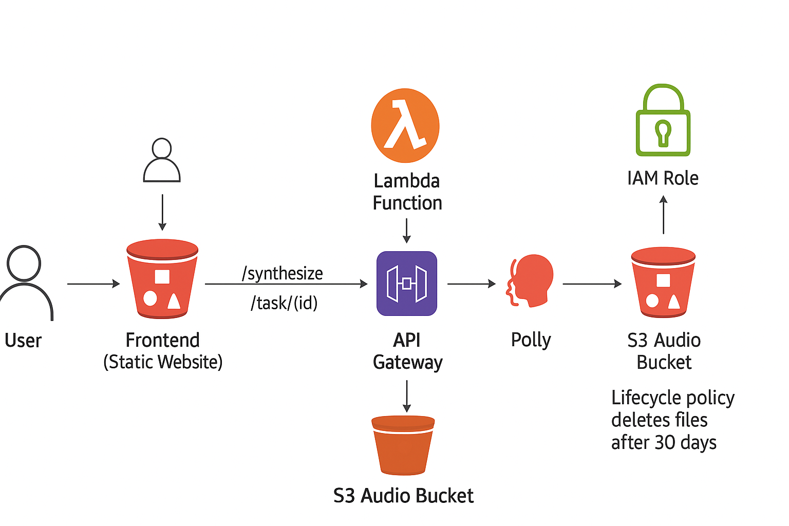
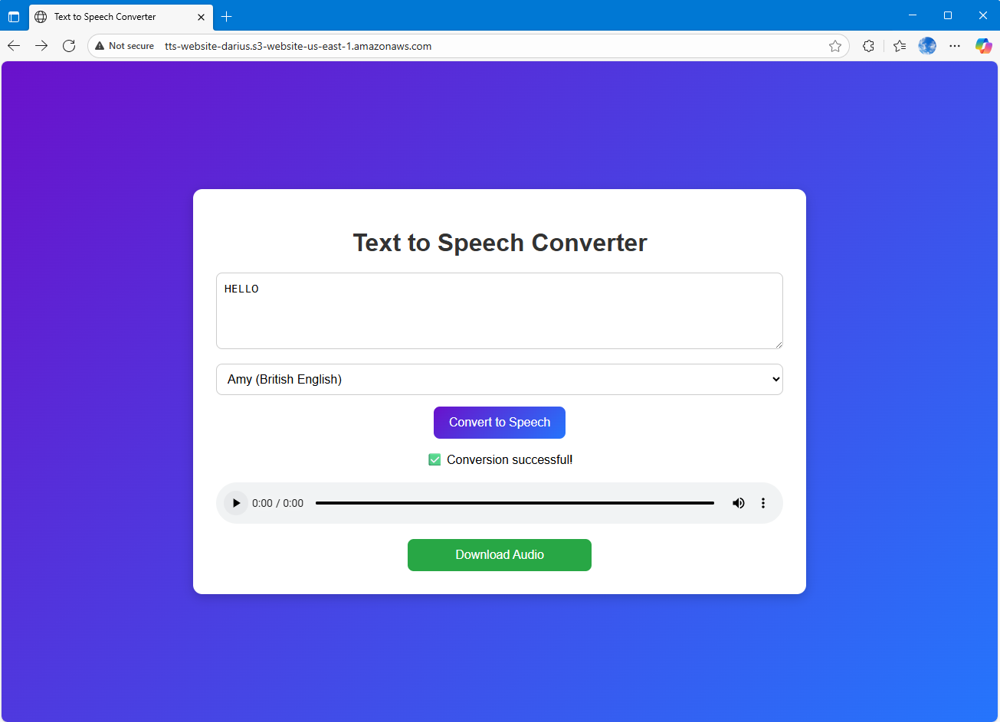

# AWS Serverless Text-to-Speech Application with AWS Polly 🎙️

This project implements a **serverless text-to-speech (TTS) application** using AWS services.  
Users can input text through a web frontend, which invokes an API Gateway endpoint. The request triggers a Lambda function that uses **Amazon Polly** to synthesize speech. The generated audio is stored in an **S3 bucket** and can be retrieved via an API or directly from the bucket.

---
[](https://docs.aws.amazon.com/serverless-application-model/) 
[](https://aws.amazon.com/lambda/) 
 


---

## 🚀 Live Link
👉 [Click here to use the app](http://tts-website-darius.s3-website-us-east-1.amazonaws.com)

---

## 📖 Project Documentation

### 1. Objectives
- Build a **scalable, cost-effective, serverless** application.  
- Integrate AWS **Polly** for speech synthesis.  
- Provide APIs for **synthesizing speech** and **retrieving tasks**.  
- Deploy infrastructure using **AWS SAM** (Serverless Application Model).  
- Demonstrate use of **IAM roles, S3 lifecycle policies, and API Gateway with CORS**.

---

### 2. System Architecture

## 🏗 Architecture


**Components**
1. **Frontend (Static Website)** → Hosted in S3, allows users to submit text.  
2. **API Gateway** → Handles `/synthesize` and `/task/{id}` endpoints.  
3. **Lambda Function** → Processes requests, calls Polly, stores audio in S3.  
4. **S3 Audio Bucket** → Stores generated audio files. Lifecycle policy deletes files after 30 days.  
5. **IAM Role** → Grants Lambda access to Polly, S3, and CloudWatch Logs.  

**Flow**
1. User submits text via frontend → API Gateway.  
2. API Gateway triggers Lambda.  
3. Lambda calls Amazon Polly → generates speech.  
4. Polly writes audio file → S3 Audio Bucket.  
5. User retrieves audio URL or downloads file.  

---

### 3. Implementation Phases

#### Phase 1: Infrastructure Foundation
- Researched AWS services for static hosting (S3 + CloudFront).  
- Investigated serverless compute (Lambda).  
- Explored API Gateway for exposing endpoints.  
- Studied IAM for role-based access.  
- Designed **`template.yaml`** using AWS SAM.  

#### Phase 2: Backend Logic Implementation
- Integrated AWS Polly for text-to-speech.  
- Configured S3 bucket for storing audio.  
- Implemented Lambda function with robust error handling & CORS headers.  
- Used environment variables to reference audio bucket.  
- Configured IAM role with least-privilege access.  

#### Phase 3: Deployment & CI/CD
- Built & deployed using `sam build` and `sam deploy --guided`.  
- Managed stack updates with `samconfig.toml`.  
- Cleaned repo of secrets & added `.gitignore`.  

---

## 1. Security Considerations

- **IAM Least-Privilege Access**: Ensure Lambda roles are restricted to only required services (e.g., Polly + S3).  
- **API Gateway Security**: Apply rate limiting, request validation, and CORS restrictions to protect endpoints.  
- **Data Protection**: Keep S3 buckets private and enforce secure access policies.  
- **Temporary Access**: Use pre-signed URLs for controlled and time-limited file retrieval.  
- **Input Validation**: Sanitize and validate user inputs to prevent malicious payloads and injection attacks.  

---

## 2. Cost Optimization

- **Serverless Pay-as-You-Go Model**: Leverage Lambda and API Gateway to avoid upfront infrastructure costs.  
- **S3 Lifecycle Policies**: Automatically delete audio files after a set time to save on storage costs.  
- **CloudWatch Monitoring**: Track execution time and optimize performance to reduce costs.  
- **CloudFront Caching**: Cache static and frequently accessed content to reduce repeated API calls and bandwidth usage.  

---

### 4. AWS Services Used
- **AWS Lambda** (serverless compute)  
- **Amazon Polly** (text-to-speech)  
- **Amazon S3** (static website hosting + audio storage)  
- **Amazon API Gateway** (RESTful APIs with CORS)  
- **IAM Roles & Policies** (secure access)  
- **AWS SAM** (infrastructure as code)  

---

### 5. Challenges & Solutions
| Challenge | Solution |
|-----------|----------|
| CORS errors in API Gateway | Defined `AWS::Serverless::Api` with CORS config |
| Secrets in repo (Azure token in `node_modules`) | Added `.gitignore`, reset Git history |
| `Cors` property invalid under Lambda events | Moved to API resource definition |
| Bucket name conflicts | Used unique bucket names (`tts-website-darius`, `tts-audio-darius`) |

---

### 6. Future Improvements
- Add **CloudFront + TLS certificate** for website delivery.  
- Implement **API Key authentication** for endpoints.  
- Enable **multipart audio processing** for very large inputs.  
- Add **CI/CD pipeline with GitHub Actions** for automated deploys.  

---

## 📘 README (For Developers)

### 🚀 Features
- Convert text into speech using **Amazon Polly**  
- Store audio files securely in **S3** (auto-expire after 30 days)  
- Expose APIs via **API Gateway**:
  - `POST /synthesize` → generate audio from text  
  - `GET /task/{taskId}` → check synthesis task status  
- Static website hosted in **S3** for frontend  
- Infrastructure managed with **AWS SAM**  

---

### 📂 Project Structure
AWS-Text-to-Speech-app/
├─ README.md
├─ template.yaml
├─ frontend/
│ ├─ index.html
│ ├─ app.js
│ └─ styles.css
├─ polly_lambda/
│ ├─ index.js
│ └─ package.json
└─ scripts/
└─ deploy.sh

---

### 🛠️ Setup & Deployment

#### Prerequisites
- AWS account with IAM permissions  
- AWS CLI configured (`aws configure`)  
- AWS SAM CLI installed  

---

## 🚀 Live Link
👉 [Click here to use the app](http://tts-website-darius.s3-website-us-east-1.amazonaws.com)

---

#### Deploy
```bash
sam build
sam deploy --guided

---

Future Enhancements

CloudFront distribution with TLS

API authentication (API keys / Cognito)

CI/CD pipeline with GitHub Actions

Support for long text with multipart Polly synthesis

---

🧑‍💻 Author
Built by Azameti Matthew (Dharius7)

```
---
## 🏗 Architecture
 